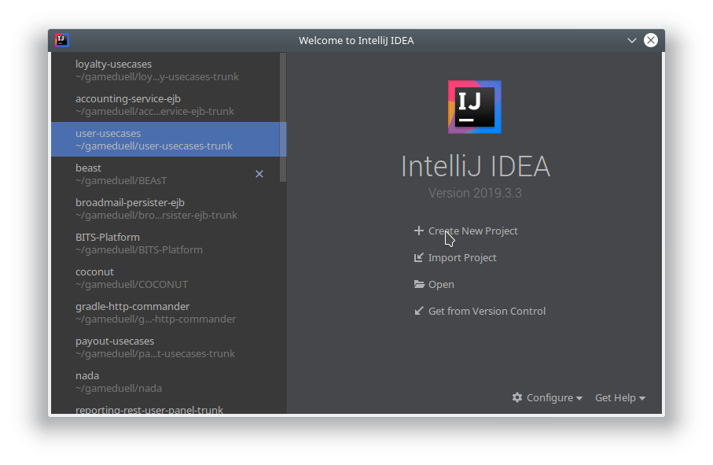
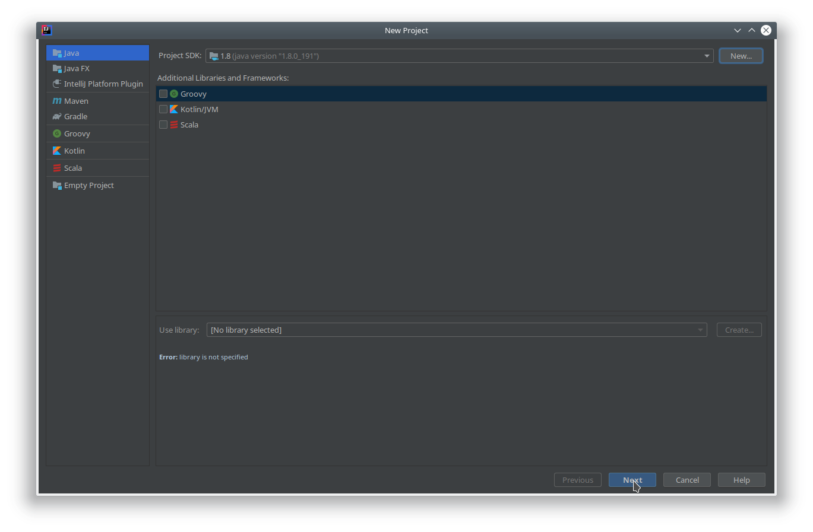
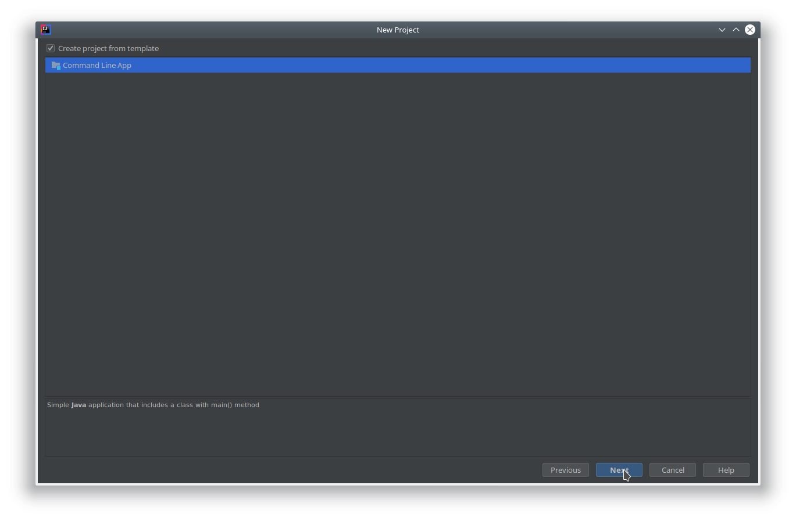
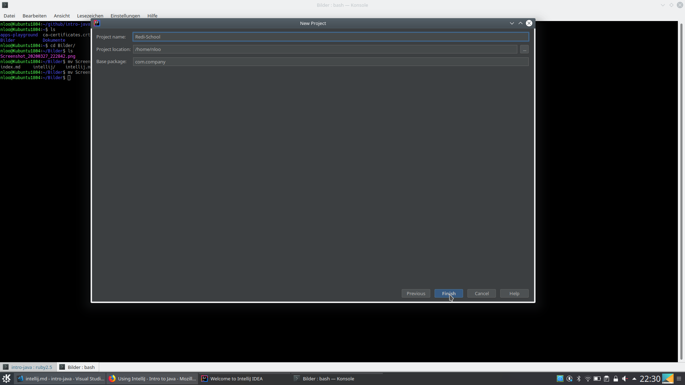
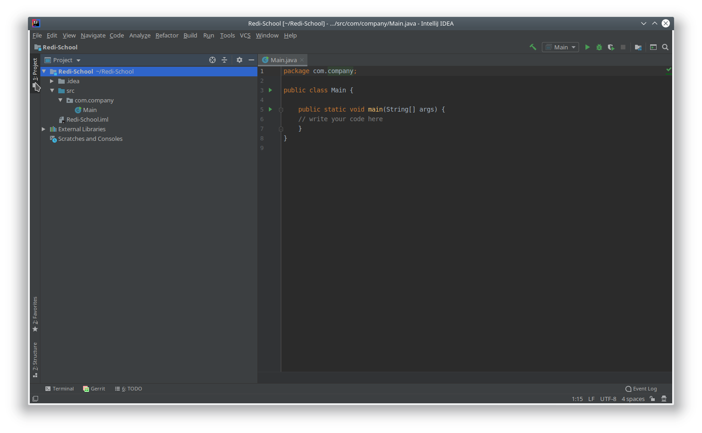
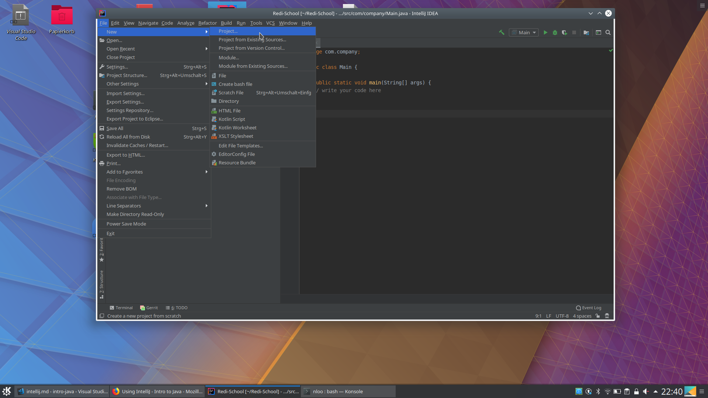
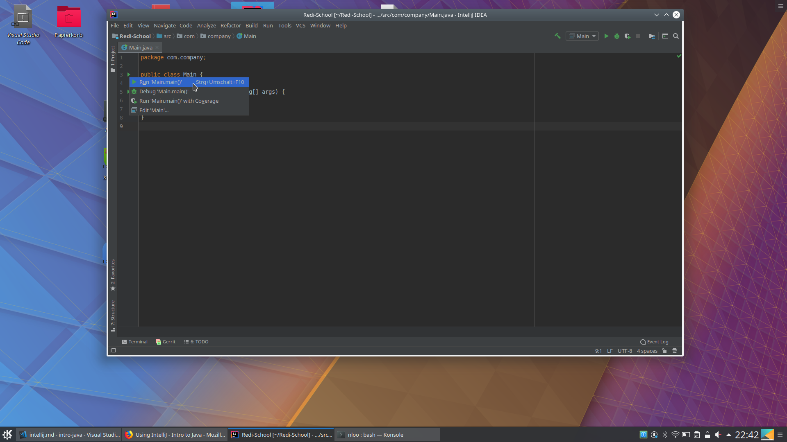
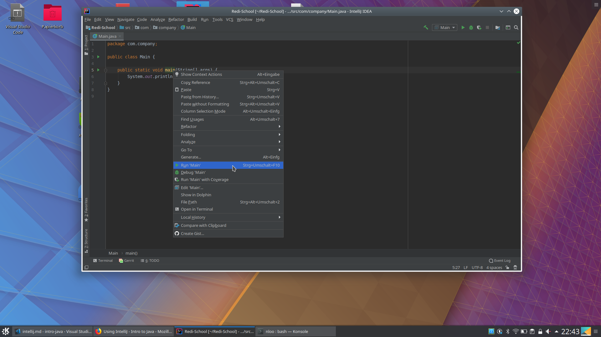
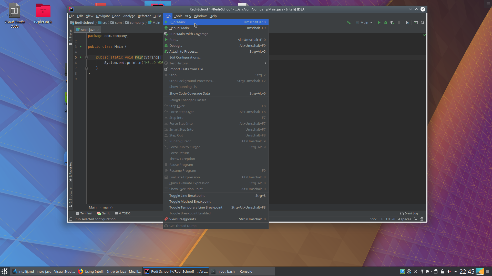
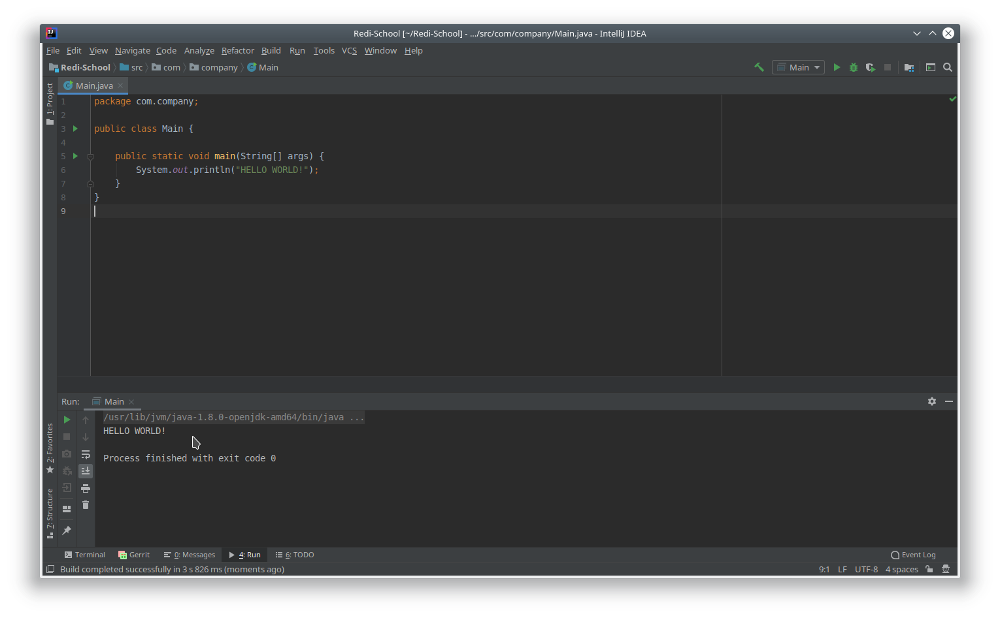

IntelliJ is an IDE (Integrated Development Environment) that is greatly suited to write Java programs (and it is also widely used by professional developers).

Though it is no necessary to use it when you start learning programming Java, it is a good choice to start using it later on (especially if you want to also take the next course **Intermediate Java** at Redi School).

Here you can find a handful of useful links to work with IntelliJ

1. TOC
{:toc}

## Installation
Note: if you have a laptop from Redi School, IntelliJ should already be installed on it.

Visit the [IntelliJ Download page](https://www.jetbrains.com/idea/download) to download IntelliJ.

Choose the free community version and follow the instructions (on the left of the page you find a link with installation instructions)

You can als find e.g. on youtube videos about installing and taking first steps with IntelliJ, e.g.:
[How to download and install IntelliJ on Windows](https://www.youtube.com/watch?v=8LF2_oIGiJ4)

## First Steps

### Creating a Java program
When you open IntelliJ, you may be greeted with a screen similar like this:



on the left side, you see a list of your recently opened projects (if you have any), so just use the _New Project_ option as start.

Now you come to the next screen where you mainly choose the programming language:



Stay with Java and select no other info. Important: the _Project SDK_ value should be set to a Java SDK on your computer. Normally, IntelliJ will be able to find it automatically. You can also check if you have multiple versions of Java on your computer by checking the drop down menu, if yes go with the newest version available. 

If no Java SDK shows up, you probably need to install it:  
Read this article about [Create your first Java application](https://www.jetbrains.com/help/idea/creating-and-running-your-first-java-application.html#) and install a Java SDK like described (note: if you have a laptop from Redi School, that should also already be installed on it).

Next screen: you may be able to create a project with some defaults: choose the comnand line app here (this will create the same what we already used in repl.it, a Java file with the main method).



Next screen: here you can configure where on your computer you want your project to be saved. Here, you can ignore the base package option for now (either leave it as is or clear it)



Now you are done and IntelliJ will show your project like in the next screen;



Note: this screen will also show up directly when you open IntelliJ the next time (it will automatically open the last project you used).

If you want to open an old project or create a new one for a new class/exercise, take a look at the next screen:



In the _File_ menu
- you can open one of your old project via _Open Recent_ (shows a list of last recently worked-on projects)
- you can open a project via _Open_ and browse your file system for it
- you can create a new one as shown the via _New_ -> _Project..._ , this will bring you directly to the project creation flow we started this section with.

### Running your Java Program
Now that you know how to create a Java project with IntelliJ, you still need to know how to run your program and feed it with inputs and see its outputs.

You should have the Java file with your main method opened, now you have several ways to run it.

First way: press any of the green play icon on the left border of your Java file and choose the option highlighted like here:



Second way: right click on the _main_ method and choose the highlighted option like here:



Third way: in the _Run_ menu choose one of the _Run_ commands like highlighted here:



IntelliJ will then compile your code and try to run it

You will see the results at the bottom of the screen => any output will be printed there and you could also pass there values to your program if you use _Scanner_ there:



## Documentation
On the IntelliJ page itself you can find already plenty of useful information.

Check out the [IntelliJ documentation page](https://www.jetbrains.com/idea/documentation/) where you find video tutorials, written documentations and How-To articles.

Its [Help Page](https://www.jetbrains.com/help/idea/installation-guide.html) contains a lot of information to also more advanced topics, so for the beginning, a good start is the _Getting started_ section.

Read there the article about [Create your first Java application](https://www.jetbrains.com/help/idea/creating-and-running-your-first-java-application.html#) and install a Java SDK like described there if needed (again: if you have a laptop from Redi School, that should also already be installed on it).

You can check if you already have the Java SDK installed by running the command
```bash
javac
```
in a console (this checks if the Java compiler is available)

## Video tutorials
Alternatively, you also find plenty of video tutorials about IntelliJ on youtube.

A good start would be an [Intro to IntelliJ](https://www.youtube.com/watch?v=S764o0mAXhg) video.

Note: you might see there some Java code you are not yet familiar with. Try to ignore this as the code itself is not important, focus on the explanations of how to use the tool.

If you have tried out and written and run your first Java programs with IntelliJ, a next step could be to learn how to debug a Java program by watching this [Debugging in IntelliJ](https://www.youtube.com/watch?v=1bCgzjatcr4) video.


