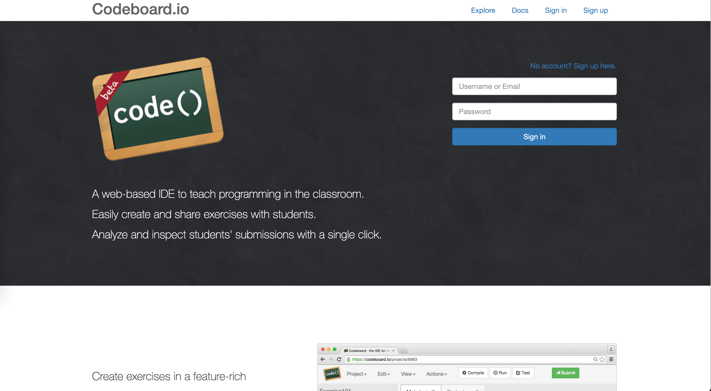
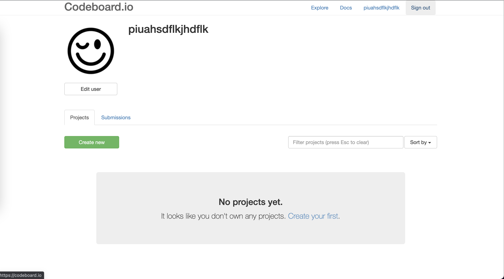
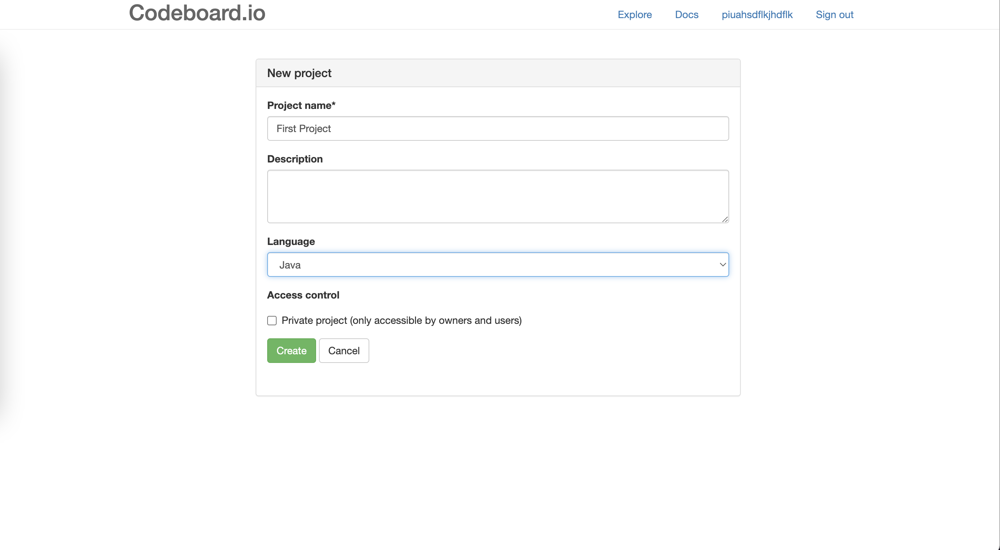
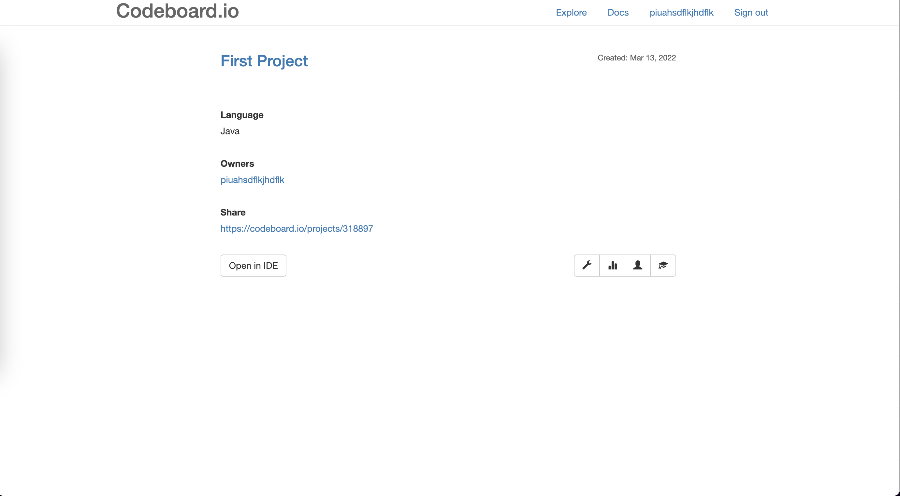
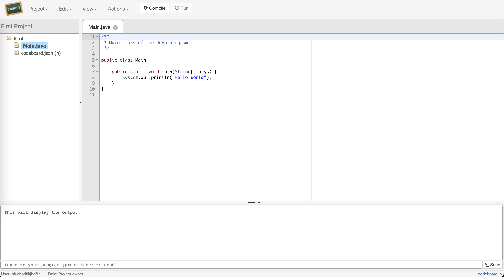

# Write Java code with codebranch.io
[codeboard.io](https://codeboard.io/) is a free, web-based editor where you can write and run programs in multiple languages (and of course, Java is one of those).

Start by visiting the [codeboard.io](https://codeboard.io/) webpage.

You will be greeted with a screen like this:

Click the **Sign up** button in the top right corner. Enter your details and click the **Create Account** button

You will then see the project landing page. This page shows all of your pojects and so it will be empty.

Click the **Create New** button and you will be taken to the page below

Choose a meaningful name for your project. If this is your first project write "First Project" for the name.

In the language drop down select **Java**. *Make sure you do not select Java-JUnit as this will add extra files which you don't need*

Click **Create** and you will be taken to a detail page as below.

Finally click on **Open IDE** and you will be able to run and edit java code. Click on Main.java on the left hand side to see the code

