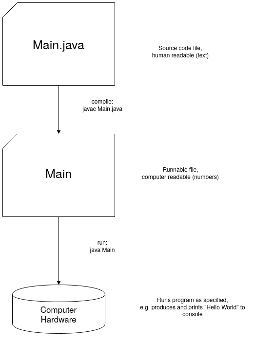

# Exercise 1: Running a Java Program
Please do this exercise in a group with other students.

Go through the questions and discuss the answers within your group.
Write them down/remember them to share later with the class.

1. TOC
{:toc}

## Precondition
You should have opened the [repl.it](https://repl.it/) website and created a new *Java* repl (do not yet change things).

If not, please visit [this page](/replit) to find out how and come back here after that.

## Objective
Goal of this exercise is to get an understanding of
* what things do you actually need do to write and run a Java program (the ingredients)
* what actually needs to happen so that a Java program is run?

## Questions
Try to find the answers within your group (in case of questions/problems => ask one of your teachers!)

### Question 1
What do you think the program will do?

If you have an idea, explain why!

Now run the program - does it do the thing you have expected?

### Question 2
Take another look at your opened *Java* repl.

You can see that it consists of three major parts.

What is the purpose of each part?

What does each contain and what can you do with it?

How are they connected with each other?

### Question 3
Run the program again.

Observe closely what happens.

How many steps do you observe while running your program?

Do you have an idea, what each step is doing?

## Observations
We saw the following three parts when opening a new project in repl.it
* on the left a folder with our source code file, _Main.java_
* in the middle our code editor: it showed the content of _Main.java_ and we can edit it there
* on the right, a console: as soon as we press the *Run* button we see some text output related to running our Java program

As soon as we ran our program, we saw three things printed out in the console:
```bash
> javac -classpath .:/run_dir/junit-4.12.jar -d . Main.java
> java -classpath .:/run_dir/junit-4.12.jar Main
Hello world!
```

## Insights
Given our observations, we learned
* what things we need to write & run a Java program
* what are the steps to go from our source code to running a Java program

Please also check our [glossary](/glossary) for terms that are unfamiliar or new to you!

### Things we need to write & run a Java program
1. We need a file in that we can save our code. This is called our *Source Code File*. For Java, such a file always needs to have the file ending *.java*, e.g. *Main.java*
2. We need an editor to open our source code file and make changes. You could use any text editor for this (as a Java source code file is just text) but normally you want to use an editor that is specialized for programming in Java (you will see later when this course progresses what such an editor can do for you)
3. We need a console where we can run the necessary commands to run our program and see its output.
4. We need of course the specific commands *javac* and *java* available on our computer.

Luckily, when using a tool like *repl.it*, all these things are already given to you, the only thing you need is Internet access.

### Steps to go from source code to running a program

The following image shows a simple overview of the steps from our source code file to our program actually running:

