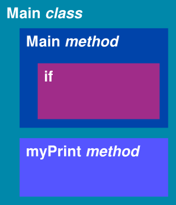

# Exercise 4: What is all this stuff

We typed or copy-pasted bits of Java code without fully understanding what certain words or certain brackets mean. Here we drop the curtain and show the meaning behind that text.

## Objective

In this exercise we will learn about:
 * Different kinds of brackets
 * Keywords
 * Importance of structure

At the end of this you should understand:
 * How do we structure code using the curly brackets
 * How and where are round brackets used
 * What are keywords and provide examples of some Java keywords
 * What is and why do we structure programs

## Brackets

Programming has a deep connection with Mathematics, first computing devices were built to solve simple math problems such as counting items or simple arithmetic. That's why there's a great deal of brackets that are in use -- they come from math.

**INFO:** If you're interested in more on this, look up the article on the [History of computing hardware](https://en.wikipedia.org/wiki/History_of_computing_hardware) on Wikipedia, also [question and answer](https://softwareengineering.stackexchange.com/questions/136987/what-does-mathematics-have-to-do-with-programming) on StackExchange.

Here are the types of brackets used in Java (and many similar programming languages).

| Bracket             | Name            | Use                                                                                             |
|:--------------------|:----------------|:------------------------------------------------------------------------------------------------|
| **`{`** and **`}`** | Curly brackets  | Organize code into blocks, we'll learn about different blocks of code in later lessons                |
| **`(`** and **`)`** | Round brackets  | Used to group parameters and expressions, think _f(x) = x + 1_                                        |
| **`[`** and **`]`** | Square brackets | Used to declare and access arrays (arrays is a way to work with multiple values of the same data type)|

There are other names for these, depending on the region or context, have look at the different names on [wikipedia](https://en.wikipedia.org/wiki/Bracket#Names_for_various_bracket_symbols).

### Curly brackets organize code

We often need to organize code, or in other words, we give the source code structure. We do this with blocks of code that start with an opening curly bracket: **`{`** and end with a closing curly bracket **`}`**.

Here's some code, try to identify different blocks  and how they relate to each other:

```java
public class Main {
  public static void main(String[] args) {
    System.out.println("Hi!");

    if (2 * (2 + 1) > 5) {
      myPrint();
    }
  }

  public static void myPrint() {
    System.out.println("Hello again");
  }
}
```

Here's how you can visualize it:




### Round brackets group

In the same example above, we can see the use of round brackets multiple times. First in the declaration of the `main` method where we group parameters (synonym: arguments), next to pass value: `"Hi!"` to the `println` method, and in the `if` statement to group _expressions_, and so on.


### Square brackets are for arrays

And we won't learn about arrays in this lesson. #fail (??? typo ???)

## Other ways of structuring code

As you might have noticed we write code over multiple lines and we use space to start the text further to the right for some lines. In general, this could be called formatting the source code or using indentation. This helps with the code being readable. Consider this example:

```java
public class Main{public static void main(String[]args){System.out.println("Hello")}}
```

It's difficult to read, isn't it? It contains several, what we call, statements or expressions but they're all crammed together and it's difficult to understand what belongs to what. So let's start by putting each statement on it's line:

```java
public class Main{
public static void main(String[]args){
System.out.println("Hello");}}
```

This is better now, but still it can be improved. We know that the curly brackets are for blocks and that blocks can contain other blocks. Let's use indentation and additional space characters to improve on this:


```java
public class Main {
⸽    public static void main(String[] args) {
⸽    ⸽    System.out.println("Hello");
⸽    }
}
```

In this example `⸽` was added to illustrate the span of the blocks, this is not valid Java code just to illustrate that. If we also indent the code, it makes it easy to read and see what is contained in which block.

Take also a note that the Java code editors help with showing where a block begins and where it ends. Try positioning the text cursor, i.e. the text insertion marker `|` after an open or closing curly bracket and notice that the corresponding bracket pair is higlighted.

## Keywords

Computers are very strict about what they understand and what they do not understand, which makes it difficult for us humans because we can adapt and understand the meaning from the surrounding context. In addition to the words we can choose, like `Main` or `myPrint`, we need to use words that the computer knows and can understand. We call these words **keywords**. Here are some examples: `public`, `class`, `static`, `void`. Our editors can help us identify keywords by showing them in a different color. Keywords need to be typed/spelled exactly as they are: `Class` is different from `class` or `klass`, and so is `Public` `PUBLIC` and `public`.

## Questions
Try to do the exercises together within your group (in case of questions/problems => ask one of your teachers!)

### Question 1
Open a *Java* repl in [repl.it](https://repl.it/).

Use the example above (copy-paste it over existing code in repl.it) and point out each bracket, and it's meaning:

 * For code blocks point where the block starts and where it ends
 * Point out where grouping is used, start and end of each group
 * Point out where square brackets are used (don't worry about arrays at this point)

### Question 2
What would happen if we put one less or one more curly bracket?

Try it out and see!

How do we fix that? How do we know where to put the right curly bracket?

### Question 3
What would happen if we don't type round brackets for `println`, `if`, or `myPrint`?

Try it out and see!

### Question 4
Call out all the keywords in a program.
