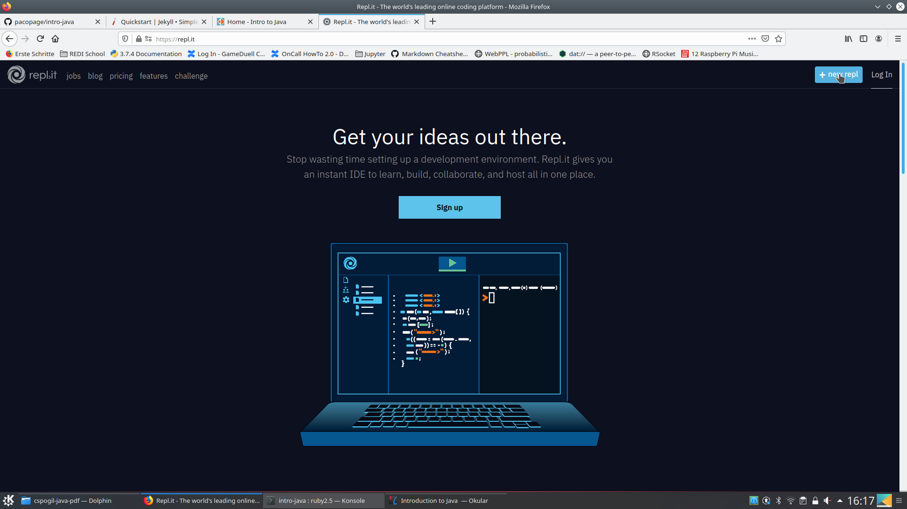
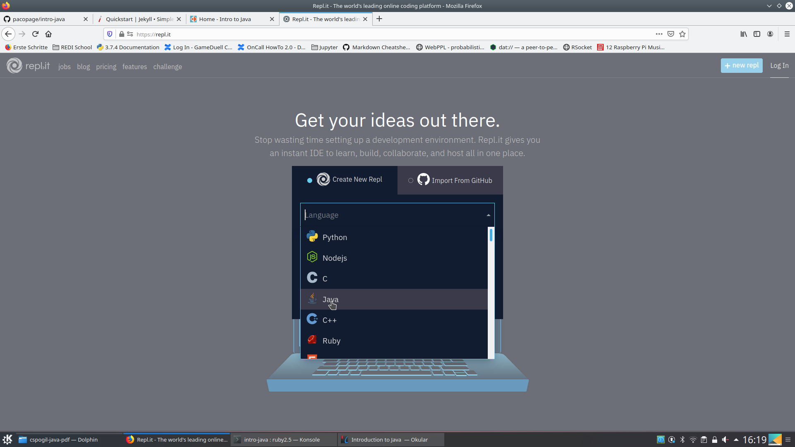
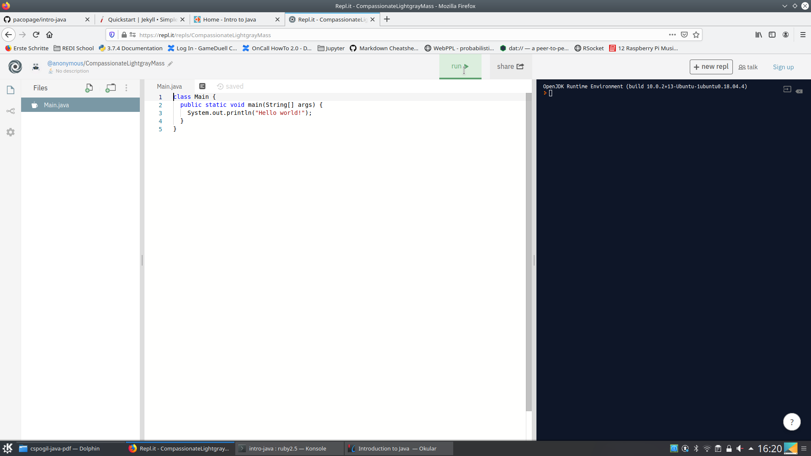

# Write Java code with repl.it
[repl.it](https://repl.it/) is a free, web-based editor where you can write and run programs in multiple languages (and of course, Java is one of those).

Start by visiting the [repl.it](https://repl.it/) webpage.

You will be greeted with a screen like this:

Click the *+ new repl* button in the top right corner (you do not need to sign up for using it).

In the following screen, select *Java* as language:

Press the *create repl* button.

You should see now the following page:

