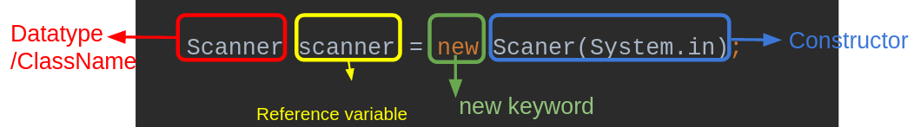

# Implementing Classes

Classes like methods are a way to structure our code. Programs can get very big. Some programs have a million lines of code or even more. So it is important that our code has a good structure so that we can easily navigate through the code to find the part of the program we need to fix, change or extend. Classes are a good tool for this.

We already used classes which exist in Java (E.g.: Scanner, ArrayList, String)



Here the word **Scanner** is the class, which also defines the datatype of our variable scanner. The **new** keyword tells Java to create a new object of this class. It calls the **constructor** of this class, which needs one parameter (System.in in this case). Later in this lesson you will learn what a constructor is and for what it is used. Right now you just need to know that a constructor is needed to create a new object of a class.

This lesson is about implementing class. In the following steps you will learn how to build your own classes.

## Class vs. Object

Java is an object oriented language. This means if we build a program we normally have to work with objects and classes a lot.
Objects are created from classes, where a class describes the properties and the behavior of an object. An object is a unique representation of its class. We as programmers also say an object is an instance of a class.

The relationship between a class and an object is comparable to a plan for a building of an architect and the real building. The plan tells how the building shall look like but the building itself may have properties, which are not exactly defined by the plan: It can be located at a special location, maybe the size of the rooms is different or the building has some additional features like a garage or a balcony... So a class is like a plan of the building and a specific realisation of this class is comparable to an object. But with the plan of the architect you could build several buildings in different places!

An object represents a specific state of a class. So if we change an object, by calling a method on it (e.g. adding an element to an ArrayList), we change the state of the object, but the class stays the same

## Don't panic: You already programmed your own classes

Everytime when we created a new repl, a class was created for us. This default class is called Main. It is defined by the **class** keyword:

```java
class Main {
}
```
Normally a program consists of several classes which are defined by us (the creators of the program). 

Often (but not always!) classes are an abstract representation of something that exists in the real world. Let's imagine we want to build an online shop. For this we would probably need classes like customer or shopping cart.

Can you think of other possible needed classes?

What are possible properties and methods of these classes?

## A first working class

As a first example we will now build a working class, which has properties, a constructor and methods.

Our first class will be **Product**, which represents a product in our online store.

An empty skeleton of this product will look like this:

```java
class Product {

}
```
Hint:
{: .label .label-yellow }
In contrast to variable or method names the name of a class shall start with an uppercase letter. Our code will also compile if we ignore this rule but Java programmers agreed on starting class names with an uppercase letter so that it is easier to distinguish between class names and other code parts like variable or method names. 

A class like this is not very useful. So we should add some properties to this class:

## Properties 

What could be properties of a product?

- name (String)
- priceInCents (int)
- id (String)
- rating (double)

The implementation of this will look as the code below:

```java
class Product{
    String name;
    int priceInCents;
    String id;
    double rating;
}
```

## Constructor

The constructor is a special method. The idea of the **constructor** is to set the initial state of a newly created object. It will be called if an object of a class is created by using the **new** keyword. As we already learned from normal methods a **constructor** method can have parameters. A **constructor** method has no return type and the name of a **constructor** method has to be the same like the class name. Our example class with a **constructor** method could look like the following:

```java
class Product {
    String name;
    int priceInCents;
    String id;
    double rating;

    public Product(String id, String name, int priceInCents, double rating) {
        this.id = id;
        this.name = name;
        this.priceInCents = priceInCents;
        this.rating = rating;
    }
}
```

As you may see from this example the **constructor** copies the values given via parameter into the instance variables.

An instance of this class could be created as it is shown in the following example:

```java
class Main {
    public static void main(String[] args) {
        Product exampleProduct = new Product("123456789", "Pencil", 99, 2.5);    
    }
}
```
## static and this

Until now we just implemented **static** methods, which are created by adding the **static** keyword to the method signature. E.g.:

```java
public static void main(String[] args) {
}
```

A **static** variable or a **static** method can be accessed without having an instance of the class. This method and variables are even existent, if no instance of the class exists at all. But a static variable of a class with the same name exists just once. So if a static variable is modified from somewhere in the program, this modification is valid for the following times when this variable is accessed until its value is changed again. 

If you want to make a variable of a class a **static** variable you just have to add the **static** keyword to the variable definition as we already did with methods (??within the class below??):

```java
class Product {
    String name;
    int priceInCents;
    String id;
    double rating;

    static int productCount = 0;

    public Product(String id, String name, int priceInCents, double rating) {
        this.id = id;
        this.name = name;
        this.priceInCents = priceInCents;
        this.rating = rating;

        productCount++;
    }
}

```

**Static** variables and methods are not used very often, but sometimes they are handy. For example if you want to count how many instances of a class exist. This task can be realized by using static variables.

The above example increases the value productCount every time a new Product object is created via the constructor.

As you may have recognized from the constructor example above, we used another keyword: **this**.
This keyword is used to reference to the current instance of the class.

This is useful if you have parameters in a method which have the same names as the instance variables. With the **this** keyword you can solve name collision as the keyword tells Java that you want to access the instance variable.

So you can use the **this** keyword just in **non static** methods.

## Non static methods

Until now we just created methods which are static (e.g. public static void main(String[] args)). This means similar to static variables, these methods can be called on a class. There does not need to be an existing instance of this class. But static methods can just access (read and change)  all static variables of this class. A static method can not access the instance variables of this class, because these variables are always connected to an object of this class.

So in our example a **static method could read and change the value of productCount** but **not the variables name, priceInCents, id or rating**.

For our Product class we could create a static method, which prints the count of already existing products in our program:

```java
class Product {
    String name;
    int priceInCents;
    String id;
    double rating;

    static int productCount = 0;

    public Product(String id, String name, int priceInCents, double rating) {
        this.id = id;
        this.name = name;
        this.priceInCents = priceInCents;
        this.rating = rating;

        productCount++;
    }

    public static void printProductCount() {
        System.out.println("There are " + productCount + " products existing in your program.");    
    }

}

```

If you want to write methods, which are able to read or modify instance variable you have to **remove the static keyword** from the method signature. In our example a handy **non static method** could be a method which returns a price string for this product in € instead of cents:

```java
class Product {
    String name;
    int priceInCents;
    String id;
    double rating;

    static int productCount = 0;

    public Product(String id, String name, int priceInCents, double rating) {
        this.id = id;
        this.name = name;
        this.priceInCents = priceInCents;
        this.rating = rating;

        productCount++;
    }

    public static void printProductCount() {
        System.out.println("There are " + productCount + " products existing in your program.");    
    }

    public String getPriceString() {
        int euros = priceInCents / 100;
        int cents = priceInCents % 100;        
        return euros + "," + cents + "€"; 
    }
}
```

Material:
- [Slides](https://drive.google.com/open?id=1JB_iSD1WZhGtIoaw6lvolvkFAGKGZM0xeUH4zRulSVs)
