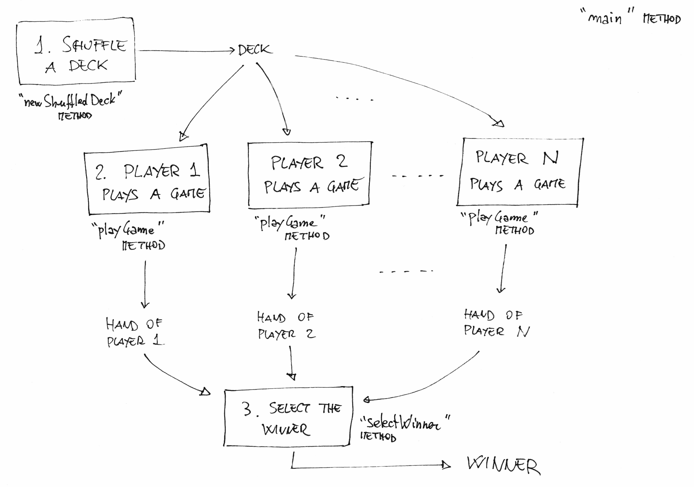
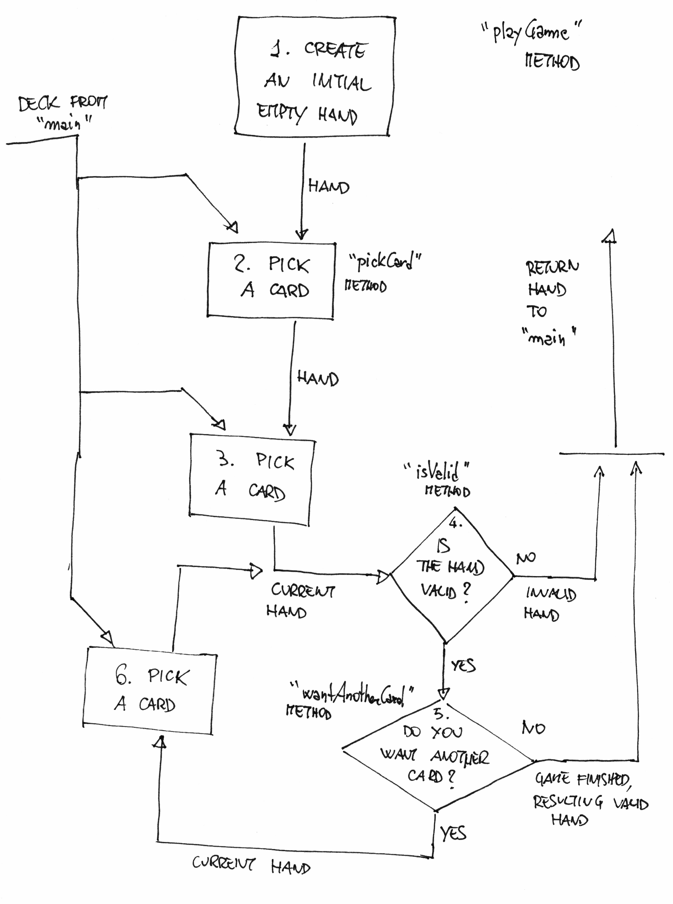

# Blackjack

We want to implement [Blackjack](https://en.wikipedia.org/wiki/Blackjack).

## What the game should do

The game should simulate one round of Blackjack.
We use simplified setup and rules.

One or more player play again the dealer.
The player that obtains the highest score without busting, wins.

Unlike in casinos, players don't play all at the same time,
but in this project they play one after the other.
Each player plays their game alone against the dealer.

The deck is shuffled at the beginning and reused between games.

Each game follow these rules:

- To each player, the dealer gives two cards.
- The player then decide whether they want another card or not.
- Players can request more than one card.
- If at any moment the player has more than 21 points, they bust.
- Players end their game when they decide they don't want any more card.

When counting points, aces may count 1 or 13, depending what's
best for the player, cards from 2 to 9 count their value,
while figures count 10.

## Design

This is the proposed design. We split it in two parts,
an main part and the single game part.
It's good when big problems are split in smaller pieces,
as it's easier to solve smaller problems than bigger ones.

For each main block of the diagrams, we introduced a method.
We defined the method parameters looking at the arrows in/out of each block.

### Main design

### Single game design

### How to start

Look at the design sketched in [Blackjack.java](Blackjack.java) and use it,
if you like, as starting point for your project.

Deviations and improvements from this design are *welcome*.
